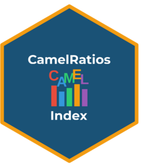

<!-- README.md is generated from README.Rmd. Please edit that file -->

# CamelRatiosIndex <a href="https://JC-Ayimah.github.io/CamelRatiosIndex/"></a>

<!-- badges: start -->

[](https://github.com/JC-Ayimah/CamelRatiosIndex/actions/workflows/R-CMD-check.yaml)
<!-- badges: end -->

## Overview

**CamelRatiosIndex** implements the multivariate-weighted indexing
method for bank performance assessment using the CAMEL framework. The
package computes composite year-on-year indices that enable:

- Comparison across multiple banks
- Assessment of bank health relative to a base year
- Evaluation of the overall banking industry health

Based on the methodology proposed by Ayimah et al. (2023a, 2023b). This
composite index is intended to offer regulators and policymakers a
standardised, objective for monitoring bank performance over time and
across institutions. Its ability to benchmark banks against a common
base year enhances early-warning capabilities, enabling supervisory
authorities to identify emerging weaknesses individual banks as well as
systemic vulnerabilities within the industry.

## Installation

You can install the the package with:

``` r
install.packages("CamelRatiosIndex")
```

And the development version from
[Github](https://github.com/JC-Ayimah/CamelRatiosIndex) using:

``` r
# install.packages("remotes")
remotes::install_github("JC-Ayimah/CamelRatiosIndex")
```

## Quick Start

``` r
library(CamelRatiosIndex)

# inspect example datasets
head(camel_2015)   # used as base year's data
head(camel_2022)   # used as current year's data

# Compute CAMEL index
result <- camel_index(camel_2015, camel_2022)

# View results
result$index_table
#> # A tibble: 21 x 3
#>    bank      I_mw    PD
#>    <chr>    <dbl> <dbl>
#>  1 Absa     102.5  2.52
#>  2 AB        98.3 -1.72
#>  3 ADB      101.8  1.78
#>  ...

# Visualize
plot_camel_index(result, highlight_banks = c("Absa", "Ecobank", "GCB"))
```

## Features

- **Tidyverse-native**: Built on dplyr, ggplot2, and tibble
- **Flexible input**: Accepts data frames or matrices with bank names
- **Robust statistics**: Uses OGK robust covariance estimation via
  `robustfa`
- **Rich output**: Returns index table, weights, eigenvalues, and factor
  analysis objects
- **Publication-ready plots**: ggplot2-based visualization with
  customizable themes
- **Built-in data**: Example datasets from 21 Ghanaian commercial banks

## The CAMEL Framework

| Dimension                 | Description | Direction                      |
|---------------------------|-------------|--------------------------------|
| **C**apital Adequacy      | Ca          | Higher = better                |
| **A**sset Quality         | Aq          | Higher = worse (auto-inverted) |
| **M**anagement Efficiency | Me          | Higher = worse (auto-inverted) |
| **E**arnings              | Eq          | Higher = better                |
| **L**iquidity             | Lm          | Higher = worse (auto-inverted) |

## Functions

| Function                 | Description                              |
|--------------------------|------------------------------------------|
| `camel_index()`          | Compute composite CAMEL index            |
| `plot_camel_index()`     | Plot percentage differences across banks |
| `print.camel_index()`    | Print method for index results           |
| `summary.camel_index()`  | Detailed summary of factor analysis      |
| `autoplot.camel_index()` | ggplot2 autoplot method                  |

## Contributing

Contributions are welcome! Please see [CONTRIBUTING.md](CONTRIBUTING.md)
for guidelines.

## License

This package is released under the MIT License. See `LICENSE.md` for
details.

## References

Ayimah, J. C., et al. (2023a). A Robust Multivariate Weighting Technique
for Computing a Measure for Inflation. *African Journal of Technical
Education and Management*, 3(1), 1-15. Retrieved from
<https://ajtem.com/index.php/ajtem/article/view/53>.

Ayimah, J.C. (2023b). Computing Multivariate-Weighted Consumer Price
Index: An Application Manual in R. B P International.
<DOI:http://dx.doi.org/10.9734/bpi/mono/978-81-19315-32-1>
