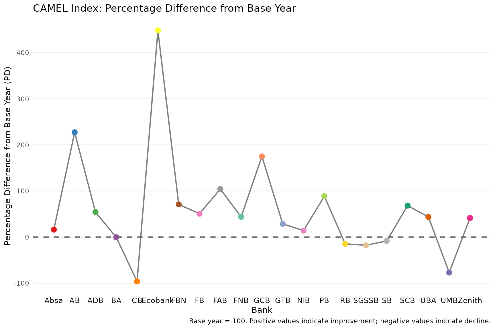
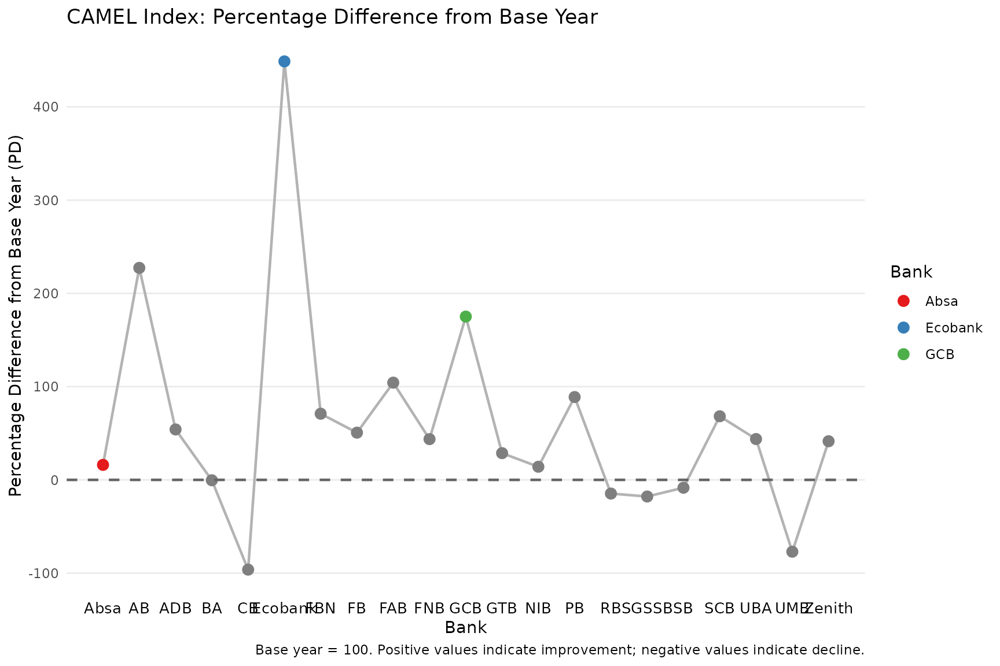
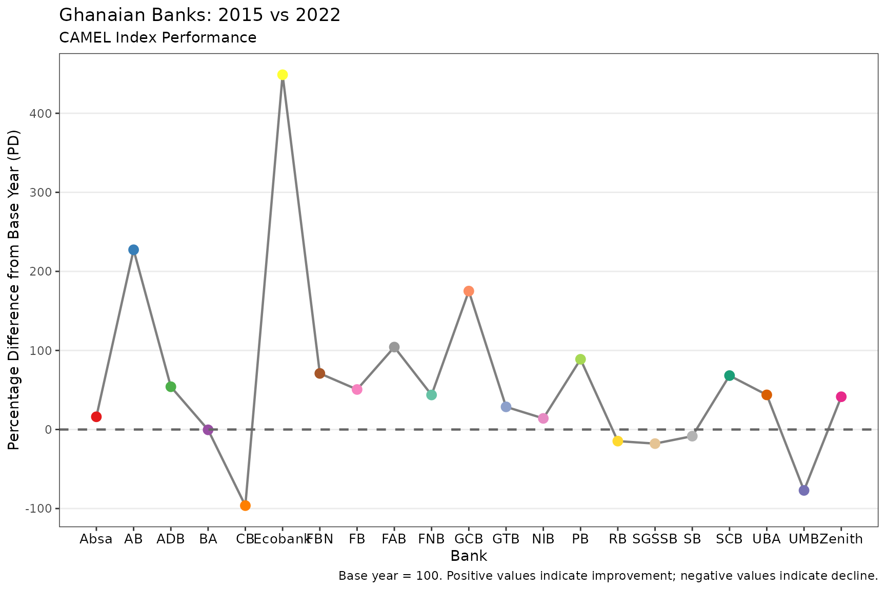

# Introduction to CamelRatiosIndex

## Overview

The **CamelRatiosIndex** package implements the multivariate-weighted
indexing method proposed by Ayimah et al. (2023a, 2023b) for bank
performance assessment using the CAMEL framework. The package provides:

- **[`camel_index()`](https://JC-Ayimah.github.io/CamelRatiosIndex/reference/camel_index.md)**:
  Computes composite year-on-year indices from CAMEL ratio data
- **[`plot_camel_index()`](https://JC-Ayimah.github.io/CamelRatiosIndex/reference/plot_camel_index.md)**:
  Visualizes percentage differences across banks using ggplot2
- **Built-in data**: Example datasets from Ghanaian commercial banks
  (2015-2022)

This composite index is intended to offer regulators and policymakers a
standardised, objective for monitoring bank performance over time and
across institutions. Its ability to benchmark banks against a common
base year enhances early-warning capabilities, enabling supervisory
authorities to identify emerging weaknesses individual banks as well as
systemic vulnerabilities within the industry.

## The CAMEL Framework

CAMEL is an internationally recognized framework for evaluating bank
performance, comprising five dimensions:

| Dimension                 | Ratio | Direction                 |
|---------------------------|-------|---------------------------|
| **C**apital Adequacy      | Ca    | Higher = better           |
| **A**sset Quality         | Aq    | Higher = worse (inverted) |
| **M**anagement Efficiency | Me    | Higher = worse (inverted) |
| **E**arnings              | Eq    | Higher = better           |
| **L**iquidity             | Lm    | Higher = worse (inverted) |

## Installation

``` r

# Install from GitHub (development version)
# install.packages("remotes")
remotes::install_github("YOUR-USERNAME/CamelRatiosIndex")
```

## Quick Start

### Computing the CAMEL Index

``` r

library(CamelRatiosIndex)

# Load built-in example data
data("camel_2015")
data("camel_2022")

# Compute the index
result <- camel_index(camel_2015, camel_2022)
#> ℹ Using 3 factors (Kaiser criterion suggests 2 for base year).

# View the main output
result$index_table
#> # A tibble: 21 × 3
#>    bank      I_mw      PD
#>    <chr>    <dbl>   <dbl>
#>  1 Absa    116.    16.1  
#>  2 AB      327.   227.   
#>  3 ADB     154.    54.1  
#>  4 BA       99.6   -0.420
#>  5 CB        3.72 -96.3  
#>  6 Ecobank 549.   449.   
#>  7 FBN     171.    70.9  
#>  8 FB      151.    50.6  
#>  9 FAB     204.   104.   
#> 10 FNB     144.    43.7  
#> # ℹ 11 more rows
```

### Accessing Detailed Results

``` r

# Laspeyres-type indices (base year weights)
result$mw_lasp
#>  [1]  1.17068455  3.24528378  1.52780746  0.98655880  0.01257239  6.02659502
#>  [7]  1.65444746  1.54951394  2.03302237  1.49816252  2.98825411  1.28723657
#> [13]  1.13849623 -1.97551778  0.82971916  0.84601356  0.94124611  1.70736177
#> [19]  1.43859304  0.28238957  1.40351131

# Paasche-type indices (current year weights)
result$mw_pash
#>  [1]  1.15082501  3.30155142  1.55371945  1.00501635  0.06177212  4.94882308
#>  [7]  1.76427243  1.46318577  2.05241470  1.37566218  2.51395785  1.28567395
#> [13]  1.14279086 -1.80089258  0.87655232  0.79703627  0.89022374  1.65663138
#> [19]  1.43712269  0.17659450  1.42483169

# Communality weights from base year factor analysis
result$weights_base
#>        X1        X2        X3        X4        X5 
#> 0.7903609 0.7050024 0.8849089 0.8942996 0.8265737

# Eigenvalues
result$eigenvalues_base
#> [1] 2.1638843 1.2551681 0.9655781 0.3240539 0.2913156
```

### Visualizing Results

``` r

# Basic plot
plot_camel_index(result)
```



``` r


# Highlight specific banks
plot_camel_index(result, highlight_banks = c("Absa", "Ecobank", "GCB"))
```



``` r


# Custom styling
plot_camel_index(
  result,
  title = "Ghanaian Banks: 2015 vs 2022",
  subtitle = "CAMEL Index Performance",
  theme_fn = ggplot2::theme_bw
)
```



## Data Format

### Data Frame Input

When using data frames, the first column must be the bank identifier,
followed by the five CAMEL ratios:

``` r

# Example structure
head(camel_2015)
#> # A tibble: 6 × 6
#>   Bank      Ca1   Aq1    Me1    Eq1   Lm1
#>   <chr>   <dbl> <dbl>  <dbl>  <dbl> <dbl>
#> 1 Absa    0.178 0.187 0.04   0.087  0.714
#> 2 AB      0.059 0.084 0.0432 0.011  0.783
#> 3 ADB     0.141 0.339 0.0669 0.024  0.965
#> 4 BA      0.229 0.101 0.0353 0.0219 0.964
#> 5 CB      0.214 0.055 0.024  0.049  1.23 
#> 6 Ecobank 0.171 0.180 0.451  0.055  0.699
```

### Matrix Input

For matrices, supply bank names separately:

``` r

base_mat <- as.matrix(camel_2015[, -1])
curr_mat <- as.matrix(camel_2022[, -1])
banks <- camel_2015$Bank

result2 <- camel_index(base_mat, curr_mat, bank_names = banks)
#> ℹ Using 3 factors (Kaiser criterion suggests 2 for base year).
```

## Understanding the Output

The
[`camel_index()`](https://JC-Ayimah.github.io/CamelRatiosIndex/reference/camel_index.md)
function returns a rich object with multiple components:

``` r

# Print overview
print(result)
#> 
#> ── CAMEL Index Results ─────────────────────────────────────────────────────────
#> Base year factor analysis: 2 eigenvalue(s) > 1
#> Current year factor analysis: 2 eigenvalue(s) > 1
#> Factors extracted: 3
#> 
#> ── Index Table ──
#> 
#> # A tibble: 21 × 3
#>    bank      I_mw      PD
#>    <chr>    <dbl>   <dbl>
#>  1 Absa    116.    16.1  
#>  2 AB      327.   227.   
#>  3 ADB     154.    54.1  
#>  4 BA       99.6   -0.420
#>  5 CB        3.72 -96.3  
#>  6 Ecobank 549.   449.   
#>  7 FBN     171.    70.9  
#>  8 FB      151.    50.6  
#>  9 FAB     204.   104.   
#> 10 FNB     144.    43.7  
#> # ℹ 11 more rows
#> ── Communality Weights (Base Year) ──
#> # A tibble: 5 × 2
#>   ratio  weight
#>   <chr>   <dbl>
#> 1 Ratio1  0.790
#> 2 Ratio2  0.705
#> 3 Ratio3  0.885
#> 4 Ratio4  0.894
#> 5 Ratio5  0.827
#> ── Summary Statistics ──
#> Mean I_mw: 160.05
#> Mean PD: 60.05%
#> Best performing bank: Ecobank (PD = 448.77%)
#> Worst performing bank: CB (PD = -96.28%)

# Detailed summary
summary(result)
#> 
#> ── CAMEL Index Summary ─────────────────────────────────────────────────────────
#> 
#> ── Eigenvalues (Base Year) ──
#> 
#> # A tibble: 5 × 3
#>   component eigenvalue variance_pct
#>   <chr>          <dbl>        <dbl>
#> 1 PC1            2.16         43.3 
#> 2 PC2            1.26         25.1 
#> 3 PC3            0.966        19.3 
#> 4 PC4            0.324         6.48
#> 5 PC5            0.291         5.83
#> ── Eigenvalues (Current Year) ──
#> # A tibble: 5 × 3
#>   component eigenvalue variance_pct
#>   <chr>          <dbl>        <dbl>
#> 1 PC1            2.06         41.1 
#> 2 PC2            1.43         28.7 
#> 3 PC3            0.788        15.8 
#> 4 PC4            0.524        10.5 
#> 5 PC5            0.199         3.97
#> ── Factor Loadings (Base Year) ──
#> # A tibble: 5 × 4
#>   ratio   Factor1  Factor2 Factor3
#>   <chr>     <dbl>    <dbl>   <dbl>
#> 1 Ratio1  0.835    0.0532    0.302
#> 2 Ratio2  0.766    0.00678  -0.343
#> 3 Ratio3 -0.162    0.920     0.114
#> 4 Ratio4 -0.00290  0.0102    0.946
#> 5 Ratio5 -0.469   -0.762     0.160
#> ── Index Distribution ──
#> # A tibble: 7 × 3
#>   statistic   I_mw      PD
#>   <chr>      <dbl>   <dbl>
#> 1 Min         3.72 -96.3  
#> 2 Q1         99.6   -0.420
#> 3 Median    144.    43.7  
#> 4 Mean      160.    60.1  
#> 5 Q3        171.    70.9  
#> 6 Max       549.   449.   
#> 7 SD        115.   115.
```

### Key Metrics

- **I_mw**: Composite index (base = 100). Values \> 100 indicate
  improvement; \< 100 indicate decline.
- **PD**: Percentage difference from base year. Positive = improvement.
- **mw_lasp**: Laspeyres-type index using base year communality weights.
- **mw_pash**: Paasche-type index using current year communality
  weights.
- **weights_base/current**: Communality values from robust factor
  analysis, representing the proportion of variance explained by each
  CAMEL ratio.

## Methodology

The index computation follows these steps:

1.  **Transform ratios**: Invert Aq, Me, and Lm so that higher values
    always indicate better performance.
2.  **Compute correlations**: Build correlation matrices for base and
    current years.
3.  **Extract eigenvalues**: Determine the number of factors
    (eigenvalues \> 1).
4.  **Robust factor analysis**: Use \[robustfa::FaCov()\] with OGK
    covariance estimation.
5.  **Extract communalities**: Use communalities as weights for each
    CAMEL ratio.
6.  **Compute indices**: Calculate Laspeyres and Paasche indices, then
    average them.
7.  **Scale to base 100**: Final composite index with percentage
    difference.

## References

Ayimah, J. C., Mettle, F. O., Nortey, E. N., & Minkah, R. (2023a). A
Robust Multivariate Weighting Technique for Computing a Measure for
Inflation. *African Journal of Technical Education and Management*,
3(1), 1-15. Retrieved from
<https://ajtem.com/index.php/ajtem/article/view/53>.

Ayimah, J.C. (2023b). Computing Multivariate-Weighted Consumer Price
Index: An Application Manual in R. B P International. DOI:
10.9734/bpi/mono/978-81-19315-32-1.
<DOI:http://dx.doi.org/10.9734/bpi/mono/978-81-19315-32-1>
