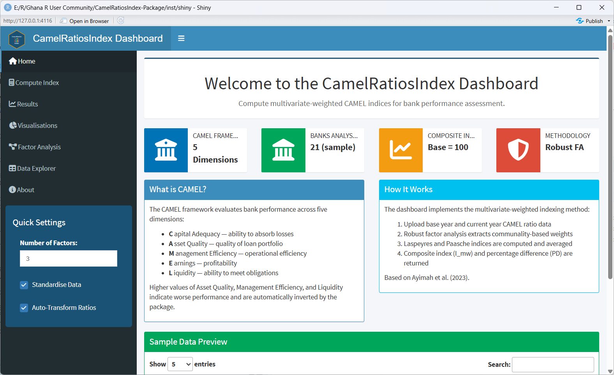
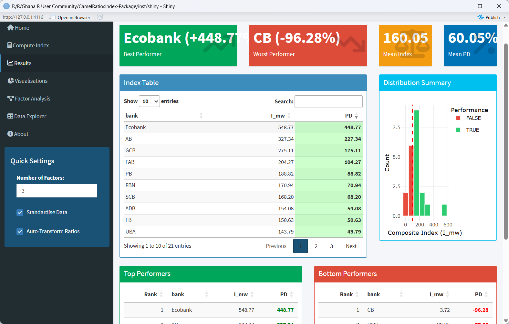
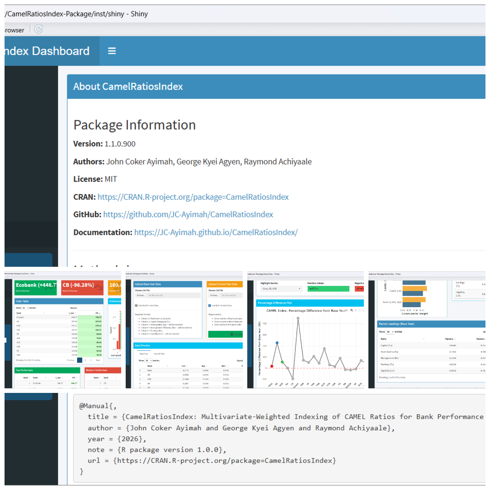

# Interactive Shiny Dashboard

## Overview

The **CamelRatiosIndex** package includes a fully interactive Shiny
dashboard that provides a graphical interface for computing and
exploring CAMEL indices. The dashboard is ideal for:

- **Regulators** who need quick visual summaries without writing code
- **Students** learning about the CAMEL framework
- **Presentations** where live computation adds impact
- **Exploratory analysis** before formal reporting

## Launching the Dashboard

``` r

library(CamelRatiosIndex)

# Launch with default settings
launch_dashboard()

# Launch on a specific port (useful for servers)
launch_dashboard(port = 3838, host = "0.0.0.0")
```

## Dashboard Features

### 1. Home Screen

- Overview of the CAMEL framework
- Quick statistics
- Sample data preview 

### 2. Compute Index

- Upload custom CSV files **or** use built-in example data
- Adjust number of factors
- Toggle data standardisation
- Preview uploaded data before computation 

### 3. Results

- `Value boxes`: Best/worst performers, mean index, mean PD
- `Interactive table`: Sortable, searchable index results with
  colour-coded PD
- `Distribution plot`: Histogram of index values
- `Top/bottom performers`: Quick summary tables
- `Download buttons`: Export results as CSV, Excel, or RDS
  

### 4. Visualisations

- `Line plot`: Percentage differences across all banks with highlighting
- `Bar chart`: Horizontal comparison with colour-coded performance
- `Radar chart`: CAMEL weight distribution (base year)
- `Histogram`: Distribution of performance differences
- `Lollipop chart`: Bank ranking relative to base year 

### 5. Factor Analysis

- `Eigenvalue plots`: Scree plots for base and current years
- `Communality weights`: Bar chart comparing base vs current weights
- `Weights table`: Numerical comparison with differences
- `Factor loadings table`: Full loading matrix from base year 

### 6. Data Explorer

- Raw base year data
- Raw current year data
- Relativity ratios (current/base)
- Laspeyres and Paasche intermediate indices 

### 7. About

- Package information
- Methodology summary
- Citation information

## Data Upload Format

The dashboard accepts CSV files with this exact structure:

| Column | Name | Description                 |
|--------|------|-----------------------------|
| 1      | Bank | Bank identifier (character) |
| 2      | Ca   | Capital Adequacy ratio      |
| 3      | Aq   | Asset Quality ratio         |
| 4      | Me   | Management Efficiency ratio |
| 5      | Eq   | Earnings ratio              |
| 6      | Lm   | Liquidity ratio             |

The dashboard automatically inverts Aq, Me, and Lm (higher = worse
performance).

## Screenshot



Dashboard Overview
